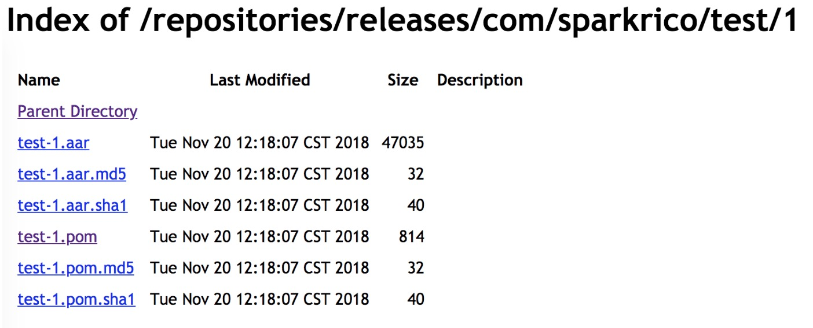

### 简书Chrome插件

### 一、安装方法

1.下载[file/jianshu.crx](file/jianshu.crx)

2.打开[chrome://extensions/](chrome://extensions/)

3.打开开发者模式

4.拖入到浏览器中安装即可

#### 二、功能
显示图片

开启插件前

开启插件后

#### 三、TODO

~~1.去掉文字~~